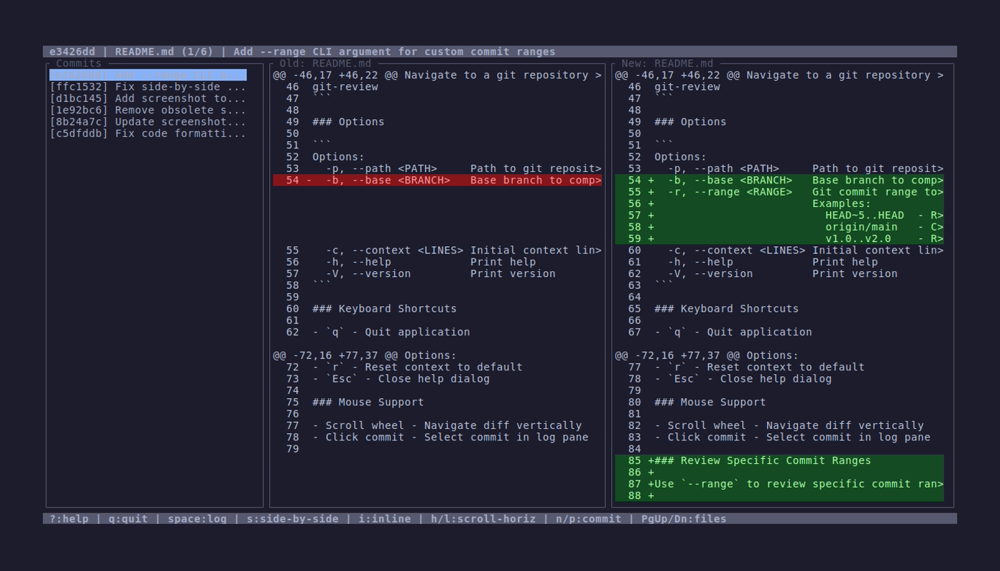

# git-review

Terminal-based code review tool for git branches with GitHub-inspired diff UI.



## Features

### Implemented
- **GitHub-inspired diff interface** - Familiar color scheme and layout
- **Responsive layout** - Works on screens from 80x24 to 200x50+
- **Side-by-side and inline diff modes** - Switch between viewing styles with proper alignment
- **Horizontal scrolling** - View long lines in side-by-side mode with `<` and `>` indicators
- **Commit log sidebar** - Navigate through branch commits easily
- **Context expansion** - Press `e` to expand context, `r` to reset
- **Interactive help dialog** - Press `?` for keyboard shortcuts
- **Mouse support** - Scroll wheel navigation and commit selection
- **File navigation** - Navigate between changed files with PgUp/PgDn

### Pending Integration
- **Syntax highlighting** - Module ready, UI integration pending
- **Review comments** - Persistence system complete, UI integration pending

## Installation

### From source

```bash
git clone https://github.com/andrewleech/git-review
cd git-review
cargo build --release
cargo install --path .
```

### From crates.io (after release)

```bash
cargo install git-review
```

## Usage

Navigate to a git repository and run:

```bash
git-review
```

### Options

```
Options:
  -p, --path <PATH>     Path to git repository (defaults to current directory)
  -b, --base <BRANCH>   Base branch to compare against (cannot be used with --range)
  -r, --range <RANGE>   Git commit range to review (cannot be used with --base)
                        Examples:
                          HEAD~5..HEAD  - Review last 5 commits
                          origin/main   - Compare current branch to origin/main
                          v1.0..v2.0    - Review commits between tags
  -c, --context <LINES> Initial context lines for diffs [default: 8]
  -h, --help            Print help
  -V, --version         Print version
```

### Keyboard Shortcuts

- `q` - Quit application
- `?` - Show help dialog (all shortcuts listed)
- `space` - Toggle commit log pane visibility
- `s` - Switch to side-by-side diff mode
- `i` - Switch to inline diff mode
- `j/k` or `↓/↑` - Scroll diff view vertically
- `h/l` or `←/→` - Scroll horizontally (side-by-side mode only)
- `n/p` - Next/previous commit
- `PgUp/PgDn` - Previous/next file within commit
- `e` - Expand context (show more surrounding lines)
- `r` - Reset context to default
- `Esc` - Close help dialog

### Mouse Support

- Scroll wheel - Navigate diff vertically
- Click commit - Select commit in log pane

### Review Specific Commit Ranges

Use `--range` to review specific commit ranges instead of comparing against a base branch:

```bash
# Review last 5 commits
git-review --range HEAD~5..HEAD

# Review commits between two branches
git-review --range main..feature/new-ui

# Review commits after a specific tag (from tag to HEAD)
git-review --range v1.0

# Review commits between two tags
git-review --range v1.0..v2.0

# Review commits in another repository
git-review --path /path/to/repo --range origin/main
```

## Configuration

Configuration is stored at `~/.config/git-review/config.toml`:

```toml
[display]
diff_mode = "side-by-side"           # or "inline"
context_lines = 8                    # Initial context per hunk
context_expand_increment = 8         # Lines added per expansion
horizontal_scroll_amount = 4         # Chars scrolled per h/l keypress
syntax_theme = "base16-ocean.dark"

[ui]
log_pane_width_ratio = 0.35          # % of terminal width (default: 35%)
show_line_numbers = true
```

## Development

See [CLAUDE.md](CLAUDE.md) and [PLAN.md](PLAN.md) for development documentation.

### Build and Test

```bash
cargo build
cargo test
cargo run
```

### Code Quality

```bash
cargo fmt
cargo clippy --all-targets --all-features -- -D warnings
```

## Release Process

Use the included `release.sh` script:

```bash
./release.sh patch  # 0.1.0 -> 0.1.1
./release.sh minor  # 0.1.0 -> 0.2.0
./release.sh major  # 0.1.0 -> 1.0.0
```

## Project Status

**Version**: 0.1.0 (Early Development)

### Completed
- [x] Git integration (commit log, diff generation, branch detection)
- [x] Responsive TUI layout (80x24 to 200x50+)
- [x] Commit log pane with selection (keyboard and mouse)
- [x] Diff view with side-by-side and inline modes
- [x] Horizontal scrolling for side-by-side mode with visual indicators
- [x] Context expansion (e to expand, r to reset)
- [x] File navigation (PgUp/PgDn between files)
- [x] Keyboard and mouse navigation (including scroll bounds and race condition fixes)
- [x] Help dialog with input blocking when visible
- [x] Syntax highlighting module (prepared, not yet wired to diff view)
- [x] Review comments system (backend ready, UI pending)
- [x] Integration and unit tests (22 tests passing)
- [x] CI/CD pipeline (GitHub Actions)
- [x] Release automation (release.sh)

### Pending Features
- [ ] Integrate syntax highlighting into diff rendering
- [ ] Add comment dialog UI and wire keyboard shortcuts
- [ ] GitHub Pages documentation site
- [ ] Terminal screenshots with termshot

### Future Enhancements (v0.2.0+)
- [ ] Performance optimization for very large diffs
- [ ] File tree view
- [ ] Search within diffs
- [ ] Configurable color themes

## License

MIT License - see [LICENSE](LICENSE) for details.

## Contributing

Contributions welcome! Please open an issue or PR on GitHub.

## Authors

- Andrew Leech <andrew@alelec.net>
